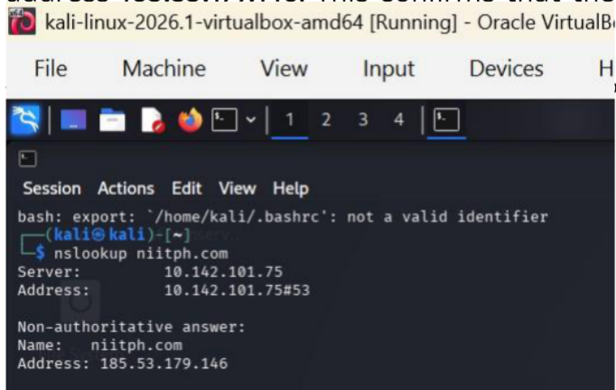
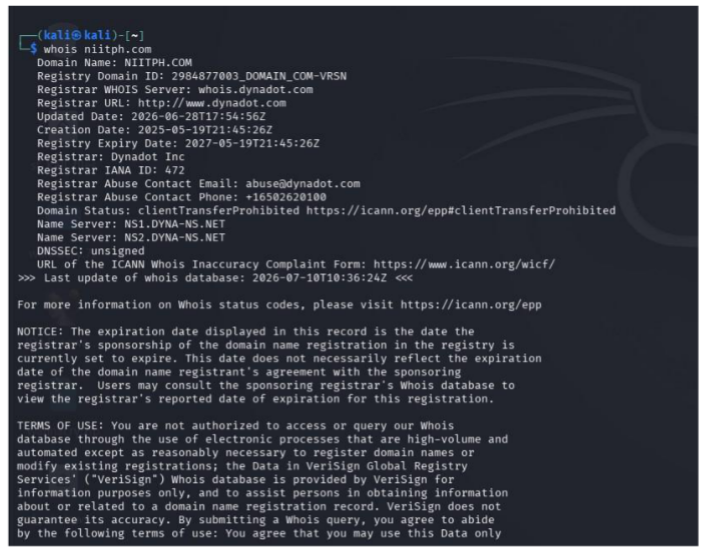
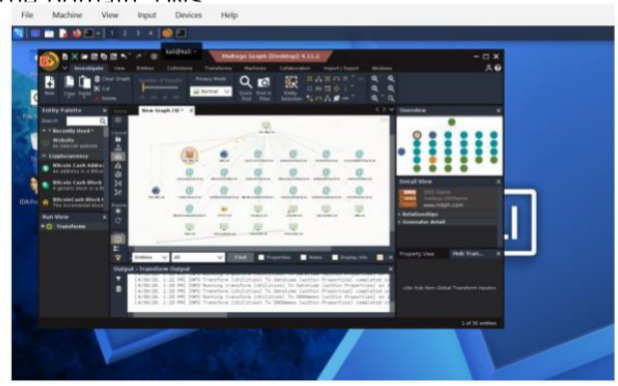

<p align="center">
  
</p>

<h1 align="center">Enterprise Threat Intelligence Assessment</h1>


---

## 📖 Project Overview

This project presents a **Passive Open-Source Intelligence (OSINT) Assessment** conducted to identify publicly available information relating to an organization's digital footprint. The assessment follows industry-recognized intelligence methodologies to evaluate exposure and recommend security improvements.

---

## 🎯 Objectives

- 🔍 Identify publicly available information
- 🌐 Assess organizational exposure
- 🖥️ Discover digital assets
- 🛰️ Investigate public infrastructure
- 📊 Assess security risks
- 📄 Produce a professional intelligence report

---

## 🛠️ Methodology

```text
Planning
    │
    ▼
Collection
    │
    ▼
Processing
    │
    ▼
Analysis
    │
    ▼
Dissemination
```

---

## ⚙️ Tools Used

| Tool | Purpose |
|------|---------|
| 🌐 NSLookup | DNS Resolution |
| 📡 WHOIS | Domain Registration Lookup |
| 🕸️ Maltego | Relationship Mapping |


---

## 🔍 Key Finding

- Public exposure of employee email addresses.
- Increased phishing and social engineering risk.
- Public DNS information successfully identified.
- Public domain registration information discovered.

---

## 🛡️ Security Recommendations

- ✅ Implement Multi-Factor Authentication (MFA)
- ✅ Conduct Security Awareness Training
- ✅ Reduce unnecessary public information exposure
- ✅ Perform periodic OSINT assessments
- ✅ Continuously monitor digital exposure

---

## 📁 Repository Contents

## 📄 Enterprise Threat Intelligence Assessment Report

<p align="center">
  <a href="./Enterprise Threat Intelligence Assessment Report.pdf">
    
  </a>
</p>
<h2>📸 Project Screenshots</h2>
### 🔍 NSLookup

DNS resolution was performed to identify the IP address associated with the target domain.

<p align="center">
  
</p>
### 🌐 WHOIS

WHOIS was used to identify publicly available domain registration information.

<p align="center">
  
</p>

### 🕸️ Maltego

Maltego was used to visualize relationships between publicly available infrastructure and domain entities.

<p align="center">
  
</p>
---

# 👨‍💼 About the Author

<p align="center">

## David Chimburuoma Odum

**Security Professional | Criminologist | Cybersecurity Analyst**

📍 Nigeria

📧 **Email:** davidchimburuomaodum@gmail.com

🐙 **GitHub:** https://github.com/davidchimburuomaodum

</p>

---

> ⚠️ **Disclaimer**
>
> This assessment was conducted using passive Open-Source Intelligence (OSINT) techniques and publicly available information for educational purposes only. No unauthorized access, exploitation, or intrusive testing was performed.

---

<p align="center">

### ⭐ Thank you for visiting this respository!
